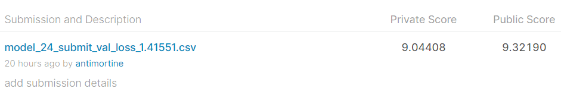

Финальное решение состоит в обучении resnext101_32x8d (используется предобученная модель из torchvision с изменённым fc-слоем) с рестартами. В качестве оптимизатора используется AdamW, scheduler - ReduceLROnPlateau. Лосс-функция до второго рестарта - MSE, затем SmoothL1Loss.  
Аугментации: RandomHorizontalFlip (только на последнем рестарте), ColorJitter, RandomErasing.  
Параметры transforms.Normalize подобраны на обучающем датасете (в ноутбуке EDA).  
Для воспроизведения результатов нужно последовательно запустить 4 ноутбука: model_18, model_19, model_20, model_24.  
Замечание: в каждом ноутбуке выставлено 100 эпох обучения, но фактически обучение останавливалось вручную при отсутствии улучшения качества на валидационной выборке.  
Датасеты должны находиться в папке LOCAL_DATA_DIR, результаты (чекпоинты, предсказания, сабмиты) будут записаны в папку DATA_DIR.  

Результаты сабмита:  
