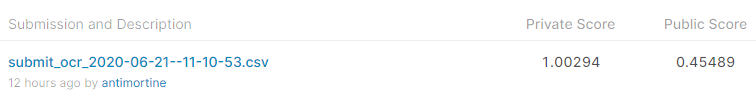
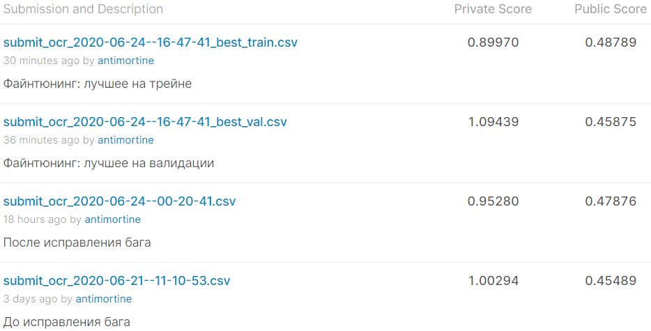

## Ключевые моменты решения

### 1. Предобработка
- перевёл тексты в латиницу и верхний регистр
- в самом начале отделил 1000 номеров (которые встречаются в датасете ровно однажды) под валидацию
### 2. Детекция
- в качестве детектора использовал предобученный maskrcnn_resnet50_fpn
- дообучал все слои, кроме первого слоя resnet
- учил предсказывать как bounding boxes, так и маски, но дальше использовал только боксы; предположительно это должно улучшить стабильность сети, но я не проверял
- при обучении следил за средним IoU на валидации
- для обученной сети порог score подобрал так, чтобы на валидации получить максимально полный набор боксов
- удалось найти такой порог, что все необходимые боксы предсказывались, а доля ошибочных боксов (1-precision) составила 6.3%
### 3. OCR
- использовал связку resnet34 и TransformerDecoder (n_layers=n_heads=8, hid_dim=dim_ff=512)
- модель OCR работала только с предсказанными боксами (и сгенерированными данными), никаких ground truth
- кроме текста она предсказывала класс - корректная ли картинка
- лосс - сумма кросс-энтропии (корректная ли картинка) и 2*CTCLoss, причём CTC считался только для корректных картинок
- все картинки ресайзил к (768, 256), после резнета на выходе размерность была (24, 8), свёрткой приводил к (24, 1)
- для классификации взял идею из BERT'a: увеличил длину входа трансформера на 1 и подавал в конец последовательности фичей специальный токен CLS, выход трансформера в этой позиции прогонялся через отдельный линейный слой
- точнее вместо токена CLS подавал обучаемый вектор размерности 512
- использовал PositionalEncoding, но вместо стандартного домножения фичей на sqrt(features_dim) умножал сам PositionalEncoding на обучаемый вес
- никакого стекинга, только обучение OCR модели с одним промежуточным чекпоинтом 
### 4. Данные для OCR
- к предсказанным боксам подмешал сгенерированные
- на каждой эпохе к реальным данным подмешивалось 10k сгенерированных (выбирались случайно)
- с вероятностью 0.063 (как в реальных предсказаниях) сгенерированная картинка портилась - делался Flip или RandomResizedCrop, гарантированно отрезавший несколько символов
- как к реальным, так и к сгенерированным применялся CoarseDropout - в половине случаев на картинку набрасывалось 1 или 2 чёрных прямоугольника, максимальный размер которых примерно равен одному символу (на такую мысль меня навели тестовые картинки типа 470, 993 (верхний левый угол :)), 1438)
- аналогично применял поворот до 30 градусов и Pad из бейзлайна
- к сгенерированным данным применял много дополнительных аугментаций: ElasticTransform, RandomShadow, ISONoise, GlassBlur, GaussNoise, JpegCompression, но все с умеренной интенсивностью (и сохранением корректности картинки), так как основная задача сгенерированных данных - не дать модели запомнить конкретные номера (особенно распределение на выходе трансформера, потому что тексты никак не аугментируются) + сохранить априорное распределение ошибок детектора
- никакие test-time augmentations не использовались

Результаты сабмита - 10-е место на public и первое на private  
  

Впоследствии я обнаружил в своём решении баг: некорректно создавал обучаемые тензоры (эмбеддинг CLS и вес перед PositionalEncoding). Его исправление дало интересные результаты
  
    